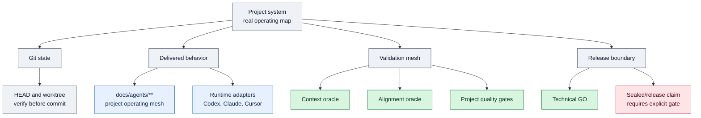
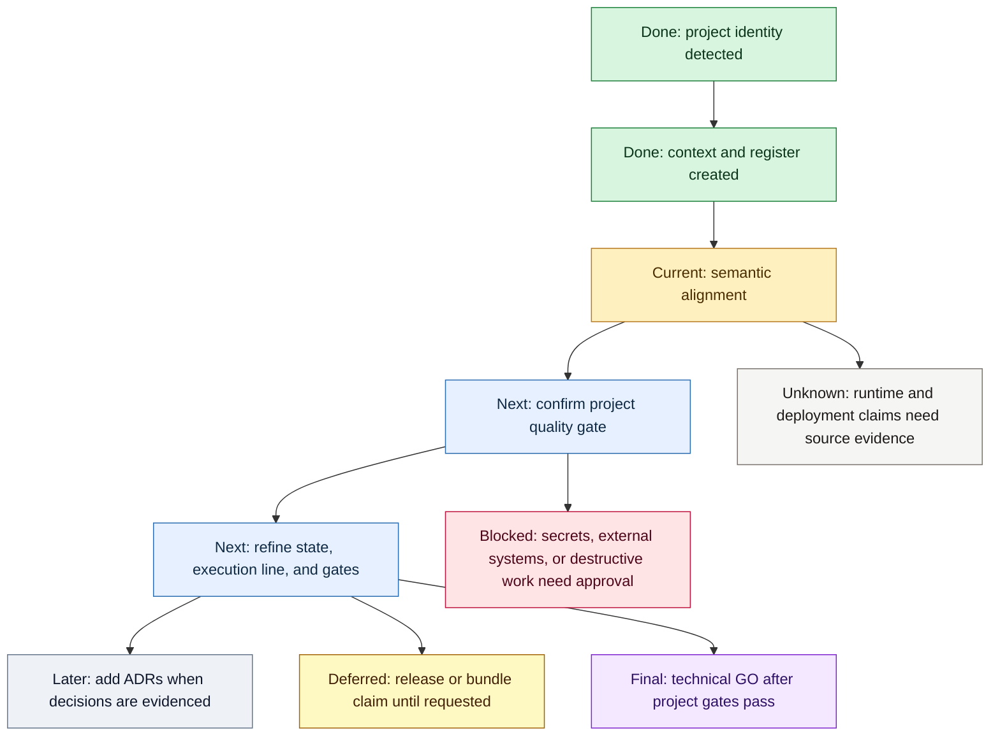

# Project Roadmap

This roadmap starts with a System X-Ray and a Convergence Line, then keeps
compact audit lanes. It prevents future agents from rebuilding what `/tes-init`
already identified and keeps uncertainty explicit.

## System X-Ray

## Convergence Line

## Current Claim

- Initial project scaffold: `PASS`.
- Alignment depth remains limited until `/tes-align` reads strong project
  anchors and updates the mesh with source-backed meaning.
- Sealed, release-ready, pushed, or commercial-use claims are not available
  until the matching Git, bundle, release, and canary gates pass.

## Next Irreversible Step

- Run the smallest project quality gate from [[QUALITY-GATES]] before commit.
- Commit only after separating unrelated staged work from this project lane.

## Done

- Project identity and source anchors were captured from `README.md`.
- `docs/agents/PROJECT-CONTEXT.md` and `docs/agents/PROJECT-REGISTER.md` were
  created as initial durable context.

## Active

- Execute `/tes-align` semantics by reading the strongest anchors and refining
  [[PROJECT-STATE]], [[EXECUTION-LINE]], and [[QUALITY-GATES]].

## Next

- Confirm the smallest safe project gate from `README.md` or package metadata.
- Promote stable facts to Cortex only after review.

## Later

- Add project-specific ADRs when architectural decisions become clear.

## Deferred

- Visual Obsidian Canvas or Bases views are optional and must point back to
  Markdown truth.

## Blocked

- Mark work blocked when secrets, external services, destructive operations, or
  missing local dependencies prevent proof.

## Unknown

- Any architecture or product claim not supported by `README.md` or
  `docs/agents/evidence/20260511T220733Z-tes-project-manifest.json` remains unknown.
