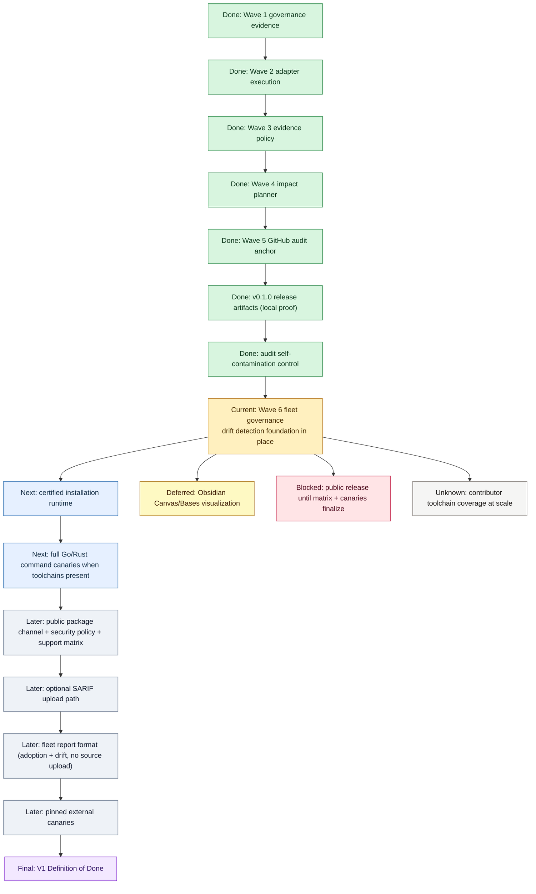

# Project Roadmap

System X-Ray and Convergence Line first; audit lanes second. Source of truth:
`docs/product-roadmap.md` (product), `README.md` (positioning),
`src/gate.ts` and `src/cli.ts` (runtime).

## System X-Ray

```mermaid
flowchart TD
  A["gate-pre-git system<br/>local Git boundary governance"] --> B["Git state<br/>HEAD 2ef45d6 / tag foundation/pre-rc-2026-05-11"]
  A --> C["Delivered behavior"]
  A --> D["Validation mesh"]
  A --> E["Release boundary"]
  A --> F["Project memory"]

  C --> C1["CLI surfaces<br/>init / doctor / check / staged / push / audit / fix / version / release / update-tools"]
  C --> C2["Vendored target<br/>.gate-pre-git/** + native hooks + workflow"]
  C --> C3["Governance map runtime<br/>zone / owner / risk / evidence / exception"]
  C --> C4["Locked adapters<br/>biome / markdownlint / actionlint / gitleaks / ruff / shellcheck"]
  C --> C5["Profiles<br/>auto / node / nuxt / python / go / rust / docs / shell / security / actions"]

  D --> D1["Bun tests<br/>tests/**"]
  D --> D2["Replay fixtures<br/>fixtures/workspaces/** + tests/replay-fixtures.test.ts"]
  D --> D3["Migration canary<br/>tests/migration-canary.test.ts"]
  D --> D4["doctor self-check<br/>config / lock / launcher / runtime / hooks / scripts / workflow / shims / smoke / version_sync"]
  D --> D5["TES oracles<br/>project_context_oracle + project_alignment_oracle"]

  E --> E1["Local Git proof<br/>commit 62d3fe3 + tag foundation/pre-rc-2026-05-11"]
  E --> E2["GitHub audit anchor<br/>.github/workflows/gate-pre-git-audit.yml"]
  E --> E3["Public package channel<br/>BLOCKED until matrix + canaries finalize"]

  F --> F1["docs/** product memory"]
  F --> F2["docs/agents/** operating mesh"]
  F --> F3["docs/agents/cortex/** durable cells"]
  F --> F4["docs/agents/evidence/** retained proof"]

  classDef system fill:#eef2f7,stroke:#475569,color:#0f172a;
  classDef behavior fill:#e6f0ff,stroke:#2b6cb0,color:#102a43;
  classDef gate fill:#d8f5df,stroke:#1b7f3a,color:#0b351a;
  classDef pending fill:#ffe4e6,stroke:#be123c,color:#4c0519;
  classDef release fill:#f3e8ff,stroke:#7e22ce,color:#2e1065;
  classDef memory fill:#fef9c3,stroke:#a16207,color:#422006;

  class A,B system;
  class C,C1,C2,C3,C4,C5 behavior;
  class D,D1,D2,D3,D4,D5 gate;
  class E,E1,E2 release;
  class E3 pending;
  class F,F1,F2,F3,F4 memory;
```

## Convergence Line

## Current Claim

- Pre-RC technical foundation: PASS. Local proof at commit `62d3fe3`, tag
  `foundation/pre-rc-2026-05-11`, with `v0.1.0` release artifacts generated
  and audited from local Git history.
- Public package distribution: not yet open. Support matrix, package
  artifacts, and pinned external canaries remain pending.
- Sealed / released / pushed-to-public-registry claims: unavailable until the
  matching project gates pass and approval lands.

## Next Irreversible Step

- Decide commit slicing for the 2-commit-ahead `main` lane (TES runtime
  refresh: modified `.tes/bin/**`, modified plugin/skill files, new
  `tes-mine`, `tes-prospect`, `tes-setup` skills).
- Run minimum project gates before any commit:
  `bun run typecheck`, `bun test`, `bun src/cli.ts doctor --target .`,
  `bun src/cli.ts check --target . --all`.

## Done (Audit Lane)

- Wave 1 through Wave 5 certified 2026-05-11.
- `v0.1.0` release artifacts generated and audited locally.
- Audit self-contamination root cause recorded and corrective control shipped.
- Replay fixture family across 8 ecosystems with passing baselines.
- TES operating mesh installed at version `0.3.101` with PASS gates.

## Active (Audit Lane)

- Wave 6 Fleet Governance: drift detection foundation present; policy
  template updates, organization standard zones, and fleet adoption reports
  remain to be implemented and certified.
- Local TES runtime refresh staged but uncommitted on `main`.

## Next (Audit Lane)

- Certified installation runtime: preflight, state classification, backup
  manifest, apply, certification, rollback report.
  Source: `docs/certified-installation.md`.
- Full Go/Rust command canaries with degraded classification when local
  toolchains are absent.

## Later (Audit Lane)

- Public package channel, security policy, support matrix.
- Optional SARIF upload path in GitHub audit.
- Fleet report format for adoption and drift without source upload.
- Pinned external canaries after local replay proof stays stable.

## Deferred (Audit Lane)

- Obsidian Canvas or Bases visualizations: optional; must reference Markdown
  truth. Source: `docs/agents/DECISIONS/001-initial-operating-mesh.md`.

## Blocked (Audit Lane)

- Public release until support matrix and pinned canaries finalize. Source:
  `README.md` "Current Maturity".
- Pinned external canaries until local replay proof stays stable. Source:
  `docs/product-roadmap.md` "Next Product Checkpoints" item 6.

## Unknown (Audit Lane)

- Contributor toolchain coverage at scale (Go/Rust presence rates).
- Real-world fleet drift volume signals before Wave 6 fleet report ships.

## V1 Definition Of Done

From `docs/product-roadmap.md` "V1 Definition Of Done":

1. `init`, `doctor`, `staged`, `fix`, `check`, `push`, `audit`,
   `update-tools` are stable.
2. Strict mode has no permissive baseline path.
3. Tool execution is lockfile-driven.
4. Trusted autofix is transactional and traceable.
5. Governance output is structured.
6. GitHub audit is minimal and documented.
7. Fixtures cover Node/Nuxt, Python, Go, Rust, docs, security, GitHub
   Actions surfaces.
8. Documentation includes an MIT license, a versioned migration guide, and
   public release checkup.
